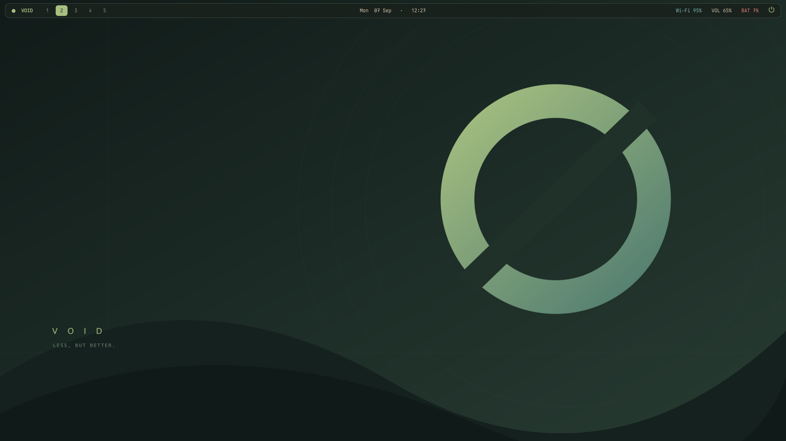

# Void desktop

A Hyprland desktop bundle for Void Linux: Ghostty, Rofi, Waybar, notifications,
a charcoal/sage theme, laptop controls, touchpad gestures, screen locking,
screenshots, and clipboard history. Original files use the [MIT license](LICENSE);
see [third-party notices](THIRD_PARTY.md) for the optional fingerprint integration.

Built for the **Lenovo ThinkPad T480**. Other laptops may need changes to the
brightness device, Fn-key bindings, touchpad gestures, display settings, battery
reporting, and optional fingerprint support.



## Repository layout

```text
config/             Hyprland, touchpad, bar, lock, menu, and notification settings
scripts/            Desktop runtime helpers installed alongside the configuration
assets/             Wallpaper source and rendered image
setup/              Dependency, desktop, Bluetooth, and login installers
  migrations/       Targeted updates for existing desktop installations
fingerprint/        Optional fingerprint integration and its tests
tests/             Desktop and installer tests
tools/             Validation and public-release tooling
docs/              Release review and supporting documentation
LICENSES/           Third-party license texts
```

`sh install.sh` remains the main entry point. The installer assembles files from
these folders into the existing `~/.config/hypr` runtime layout. Source organization
does not change key bindings or require rearranging an installed desktop.

## Compatibility

Validated on a **ThinkPad T480** running Void **x86_64 glibc**, Hyprland **0.56.2** (Lua configuration), Rofi
**2.0**, and Ghostty **1.1.3**. This is a configuration bundle, not a distribution
or a claim of compatibility with every laptop. Newer Hyprland versions may change
the Lua API. The configured keyboard layout is US and display scale is 100%.

Start with working graphics, system D-Bus, elogind, and a graphical session.
Install a compatible Hyprland and hyprland-guiutils separately if they are not
available from your configured repositories. This bundle does not add repositories
or compile the compositor. Network controls assume NetworkManager; audio assumes
PipeWire. Resolve existing network/audio service choices before installing.

References: [Hyprland installation](https://wiki.hypr.land/Getting-Started/Installation/),
[Void sessions](https://docs.voidlinux.org/config/session-management.html),
[Void networking](https://docs.voidlinux.org/config/network/index.html),
[Void PipeWire](https://docs.voidlinux.org/config/media/pipewire.html).

## Install

From this directory, as your normal desktop user:

```sh
sh setup/install-deps.sh --dry-run
sh setup/install-deps.sh
bash tools/check.sh
sh install.sh --dry-run
sh install.sh
```

The package step uses sudo, skips installed packages, and lets XBPS ask for
transaction confirmation. The configuration installer writes under
`${XDG_CONFIG_HOME:-$HOME/.config}` and refuses existing files unless you specify:

```sh
sh install.sh --backup
```

This copies the bundle configuration, replacing local edits, and backs up the
existing `hypr`, `pipewire`, and portal preference directories. A bundle-managed
fingerprint authentication block is preserved in the installed `hyprlock.conf`. Symlink
installation destinations are refused. Backups can contain private settings:
keep them outside a public repository. The printed backup path is used for rollback.

The installer adds Void's WirePlumber/Pulse startup examples only when matching
system/user drop-ins are absent. It does not replace another audio server or
activate system services. The desktop startup helper starts the user applications.

Log out of another desktop before starting a separate session:

```sh
dbus-run-session start-hyprland
```

For a first install inside an existing Hyprland session:

```sh
hyprctl reload
bash "${XDG_CONFIG_HOME:-$HOME/.config}/hypr/desktop-start"
```

After updating running utilities, log out/in so they load the new files. Desktop
startup avoids duplicate bar, wallpaper, notification, idle, and clipboard helpers.

## Controls

| Shortcut | Action |
|---|---|
| Super + Space | Desktop menu |
| Super + Alt + Space | Application launcher |
| Super + T / Return | Ghostty terminal |
| Super + Shift + Return | Firefox |
| Super + Shift + F | Thunar |
| Super + Q / W | Close focused window |
| Super + arrows | Focus a window |
| Super + Shift + arrows | Swap windows |
| Super + 1–9 / 0 | Switch workspaces 1–10 |
| Super + Shift + number | Move window to workspace |
| Super + Shift + T | Toggle floating |
| Super + F | Toggle fullscreen |
| Super + S / grave | Show/hide scratchpad overlay |
| Super + Alt + S | Move window into scratchpad |
| Super + L | Lock screen |
| Print / Shift + Print / Super + Print | Region / all displays / active-window screenshot |
| Super + V | Clipboard history |
| Super + K | Complete shortcut list |

The scratchpad overlays numbered workspaces. Its windows can stay visible while
you switch workspaces underneath. A **▣** bar indicator appears while it is open;
click it to hide the scratchpad. Use Super+Shift+number to return a window to a
numbered workspace. `python3 scripts/restore-scratchpad.py` moves all scratchpad windows
to the current numbered workspace.

The bar exposes workspaces 1–5; all ten remain available by keyboard. Workspace
highlighting follows the globally focused workspace. The supplied bar and display
presets primarily target a laptop with one optional external monitor.

### Touchpad

| Gesture | Action |
|---|---|
| One-finger tap | Left click |
| Two-finger tap or physical press | Right click |
| Two-finger scroll | Natural scrolling |
| Three-finger horizontal swipe | Switch workspace |
| Three-finger up | Application launcher |
| Three-finger down | Toggle scratchpad |
| Four-finger up | Toggle fullscreen |
| Pinch | Application zoom where supported |

`config/touchpad.lua` defines this map. Pinch is not intercepted by the compositor.
Hardware must report the required finger counts. Physical two-finger clicking
was confirmed; test the remaining gestures and app zoom on your hardware.

### Laptop keys and displays

Volume, microphone mute, brightness, and playback use XF86 key symbols. Fn Lock
controls whether Fn must also be held. Display/WLAN/tools/Bluetooth/favorites
symbols open display settings, toggle Wi-Fi, open settings, open Blueman, and open
the desktop menu respectively. F11 is unassigned. Use `wev` to identify other keys.

Brightness uses elogind's active-session `SetBrightness` API without direct sysfs
writes. The first internal backlight is used; see `python3 scripts/brightness --help` for
selecting another. External-monitor brightness is not included.

The display menu offers laptop-only, external-only, extend, and mirror. Other
outputs are disabled by a preset. Confirm within 15 seconds or it reverts.
Changes are temporary; edit `config/hyprland.lua` for persistent rules. Use
`python3 scripts/display-menu --list` for detection. Its output can contain monitor serials;
do not publish it without redaction.

Battery totals use energy-weighted percentages. `BAT`, `CHG`, `AC`, and `FULL`
indicate battery operation, charging, plugged-in, and full. Incorrect or missing
firmware capacity readings remain a known hardware limitation.

## Locking, clipboard, and portals

First test Super+L and successfully unlock with your password. Then enable idle
locking:

```sh
bash "${XDG_CONFIG_HOME:-$HOME/.config}/hypr/enable-idle.sh"
```

This creates `hypr/idle-enabled`: lock after five minutes, screen off after ten,
and lock before suspend. Removing the marker disables future automatic startup;
stop the current hypridle process or log out to disable it immediately. System
lid policy is not changed. Suspend/resume has been exercised on one laptop; test
it on your own hardware after saving work.

Clipboard watchers store text and images on disk in cliphist's cache. They may
store sensitive copied material. Desktop menu → Clear clipboard history erases
history but not the current clipboard. Screenshots are saved in the XDG Pictures
`Screenshots` directory with private file permissions and copied to the clipboard.
Runtime logs live under `$XDG_RUNTIME_DIR/void-desktop` and are not release files.

Portal preferences use Hyprland for capture and GTK for file selection. D-Bus
interfaces were checked; browser sharing still needs an end-to-end application
test. Bluetooth audio also needs a headset test on the target machine.

## Optional system integration

Bluetooth, after dependency installation:

```sh
sudo sh setup/setup-bluetooth.sh "$USER"
```

This adds your account to the bluetooth group and enables bluetoothd. Reboot to
refresh membership. It does not restart shared D-Bus. See [Void Bluetooth](https://docs.voidlinux.org/config/bluetooth.html).

On an existing LightDM installation:

```sh
python3 setup/setup-login.py "$USER" --dry-run
sudo python3 setup/setup-login.py "$USER"
```

This selects Hyprland for the account and the fallback seat session, installs a
Wayland-aware wrapper, and preserves X11's `/etc/lightdm/Xsession`. It does not
start/restart LightDM, change passwords, or enable autologin. Root-only backups
are placed in `/var/backups/void-desktop-login-TIMESTAMP`. The AccountsService
preference is updated separately; use the greeter session chooser to change it
back. Restore the backed-up LightDM configuration and wrapper to undo those parts.
Keep a text console available (Ctrl+Alt+F2) when testing login changes.

Fingerprint support is a separate, experimental opt-in for a particular reader.
See [fingerprint setup](fingerprint/README.md). Normal installation does not touch
fingerprint firmware, biometric enrollment, PAM, or fingerprint services.

## Customize and restore

Edit `config/hyprland.lua`, `config/touchpad.lua`, `config/waybar.json`, `config/waybar.css`, `config/menu.rasi`, and
`config/mako.conf`. Application choices live in `config/hyprland.lua` and `scripts/void-menu`. The theme
uses DejaVu fonts. Wallpaper source and a rendered PNG are included.

Small `setup/migrations/apply-*.py` helpers update selected settings for existing installs;
they are not required for a fresh install. Run them as the normal desktop user.
`setup/migrations/apply-style.py` is an alias for installing the whole bundle with backups.

To restore: log out, move the current `hypr` directory aside, and copy the backed-up
`hypr` directory to your configuration root. Restore portal and PipeWire files
from backup as needed; remove only bundle-added drop-ins when no prior file
existed. Packages and separately enabled system services remain installed.

## Verify and publish

```sh
python3 tools/check-release.py
python3 -m unittest discover -s tests
bash tools/check.sh
```

The first command checks the explicit release manifest, code syntax, archive
exclusions, and common secret/personal-path patterns without accessing hardware.
`tools/check.sh` also requires the desktop dependencies and parses Hyprland/Rofi configs.
Neither replaces physical input, display, or authentication testing.

See [release review](docs/RELEASE_REVIEW.md) for findings, scope, and known limitations.
Build the public source archive with `python3 tools/build-release.py`; publish the
archive or its extracted contents, not a recursive copy of this working directory.
